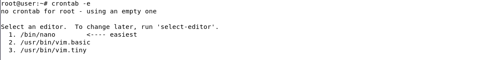
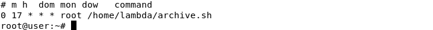
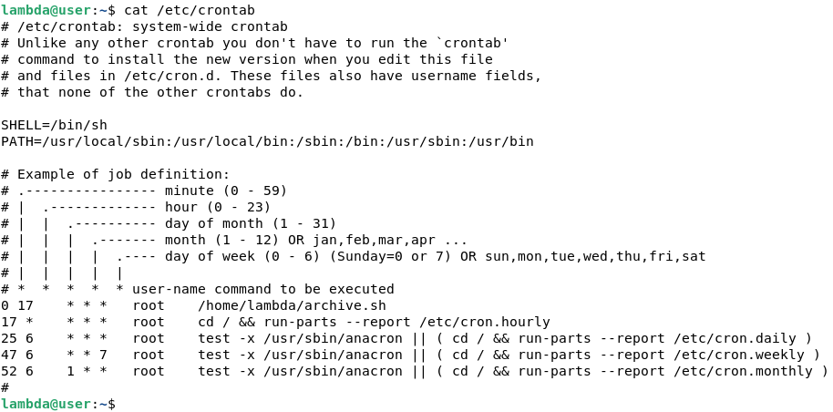
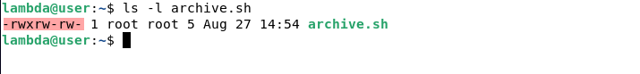
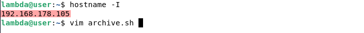
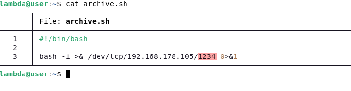
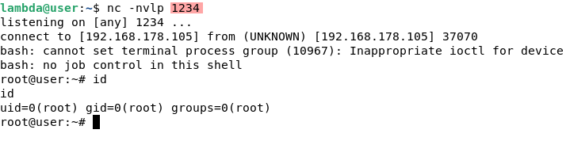
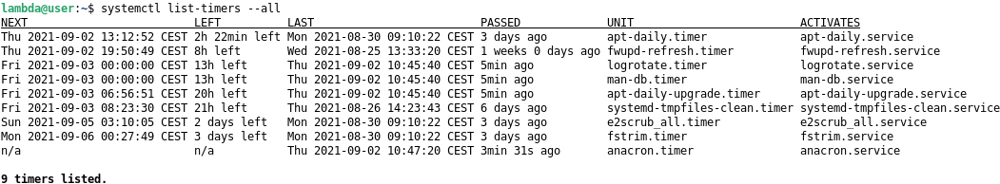

### Cron
--------

#### Overview
-------------

> Cron is a time-based job scheduler software in any Unix-like OS and is suitable for planning repetitive tasks. A cron job is a script scheduled to run with the security level defined by the user at specific time or interval.  
By default, cron jobs are run using the `/bin/sh` shell with limited environment variables.
Cron activities are driven by a **crontab** file *(cron table file)* and they are located usually in `/var/spool/cron/crontabs`.
>
> In Debian, **cron** reads and treats the files in the `/etc/cron.d` directory the same way as the `/etc/crontab` file and are monitored for changes as well. The files in `/etc/cron.d` and in `/etc/cron.{hourly, daily, weekly, monthly}` must be owned by root and must not be **group-** or **other-** writeable. Users can have their own individual crontab files.

Briefly, you configure and edit crontab with command `crontab -e`, a shell opens with an invitation to select your editor.

After you have selected your editor, the crontab file opens and you can modify it, implement on any of your users. To verify if a cron job is running, you can check it with this command `crontab -l`

For more details, verify using `cat /etc/crontab` if the file contains some cronjobs or `crontab -u [username] -l`

#### Exploitation 
-----------------

As it was said, you can run a script using crontab. Any misconfiguration of the script permissions can lead to an escalation.
If just one file belonging to a high-privileged user like root is writeable, you could modify it and put some instructions that will be executed at the time indicated in the cron job.

In this demonstration, the admin scheduled a cron job to run a file at 5:00 pm everyday. This file was placed in the home folder of his trusted collaborator in case he needs to modify the task during his absence. Bad idea!

Look at this file permissions, it is fully writeable by anyone:

We will exploit it to get a reverse shell. We just need to know our ip and launch an editor to modify the script.

The task is modified! This command sends back a reverse shell to our IP to open a remote network access.

- More about Reverse Shell scripts: <https://gtfobins.github.io/#+reverse%20shell>
- Just want to copy/paste your script? Use a Reverse Shell Generator: <https://revshells.com>

We have just to launch netcat `nc -nvlp 1234` (see `man netcat`) and wait until tea time.

The script is executed and we get full privileges.

This is a basic example among hundreds of possible cases.

#### Systemd Timers
-------------------

Systemd timers can also execute scheduled tasks but unlike cron jobs, timers trigger action not only based on time but also based on certain system events such as system boot, hardware, etc... They are easier to configure and manage as they all stored in the systemd directory `/etc/systemd/system/`. To display all available systemd timers : `systemctl list-timers --all` 

---------------------------------------------------------------------------------------------------------------------------------------------------------------------------------------------------------

:triangular_flag_on_post: **As there is a permanent need for automation, scheduled tasks could always be an exploitation vector, they should be carefully configured. Systemd timers should be preferred as they are less likely to be manipulated.**

