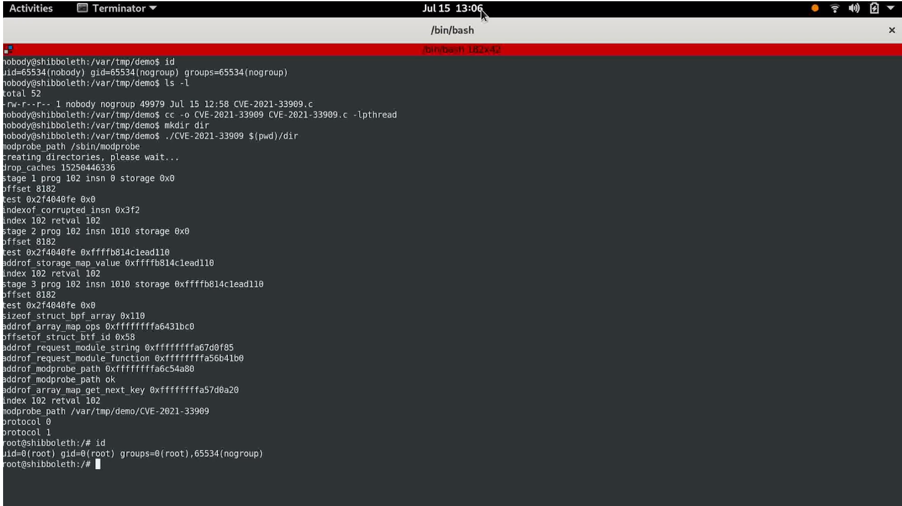

### Kernel
__________

#### Kernel Overview
--------------------
> A kernel is the core component of an operating system. Using interprocess communication and system calls, it acts as a bridge between applications and the data processing performed at the hardware level.
When an operating system is loaded into memory, the kernel loads first and remains in memory until the operating system is shut down again. The kernel is responsible for low-level tasks such as disk management, task management and memory management.
>
> There are five types of kernel, micro, nano, exo, hybrid and monolithic. Linux Kernel Architecture is monolithic as is the traditional design of UNIX-like systems, so talk briefly about that. In a monolithic kernel, all OS services run along with the main kernel thread, it is one single program that contains all of the code necessary to perform every kernel-related task. Every part which is to be accessed by most programs which cannot be put in a library is in the kernel space. Monolithic kernels tend to be better at accessing hardware and multitasking because if a program needs to get information from memory or another process running it has a more direct line to access it and doesn’t have to wait in a queue to get things done. This however can cause problems because the more things that run in supervisor mode, the more things that can bring down your system if one doesn’t behave properly. Successful exploitation of this vulnerability allows any unprivileged user to gain root privileges on the vulnerable host.

#### Kernel Exploitation
------------------------
> Kernel exploitation is a large field but the main purpose of a kernel exploit is to get privileges and the key to kernel exploitation is the arbitrary write function and triggering a [kernel panic](https://en.wikipedia.org/wiki/Kernel_panic) condition.
#### An Exploit Case
--------------------

> At the time of writing, researchers from cybersecurity firm Qualys found a new flaw to exploit named "Sequoia" who can allow an unprivileged attacker to get root privileges on most Linux distros since 2014. The issue has been assigned the identifier CVE-2021-33909 and affects default installations of Ubuntu 20.04, Ubuntu 20.10, Ubuntu 21.04, Debian 11, and Fedora 34 Workstation. Red Hat Enterprise Linux versions 6, 7, and 8 are also affected by the vulnerability. [*](https://blog.qualys.com/vulnerabilities-threat-research/2021/07/20/sequoia-a-local-privilege-escalation-vulnerability-in-linuxs-files)

- Proof of Concept:
-------------------
The reserchears wrote the [exploit](https://www.qualys.com/2021/07/20/cve-2021-33909/cve-2021-33909-crasher.c) and executed it.




#### Mitigations
----------------

You must to verify which kernel your system has and if there are known vulnerabilities because it is what the hacker will certainly do in his enumeration process. You can check it with the following commands:

```console
targeted@user:~$ cat /proc/version
Linux version 5.8.0-63-generic (buildd@lgw01-amd64-035) (gcc (Ubuntu 9.3.0-17ubuntu1~20.04) 9.3.0, GNU ld (GNU Binutils for Ubuntu) 2.34) #71~20.04.1-Ubuntu SMP Thu Jul 15 17:46:08 UTC 2021

```
or

`uname -a, uname -mrs`

and simply google `exploit db linux 5.8.0 -63` to get this [link](https://www.exploit-db.com/exploits/50135)

:triangular_flag_on_post: **0day exploits are very usual, some stay underground many years, fortunately analysts work everyday on this topic and release fixes as soon as possible to protect our systems, a very good practice is to update frequently after testing the solution and staying aware from adequate sources.**

#### Live demonstration
-----------------------

For our demonstration, we use an old release, [Ubuntu LTS 16.04.4-116 LTS](http://old-releases.ubuntu.com/releases/16.04.4/) in a VM.
The payload is a well-known [dirty.cow](https://www.exploit-db.com/exploits/44298)

