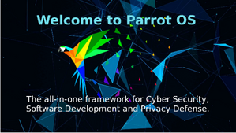
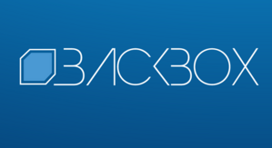
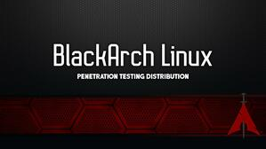

## Tools
________

> To get into the user's shell it is one thing but it is another to enumerate the vulnerabilities and exploit them. In this purpose, the intruder will use existing methods or even better develop custom-made solutions to reach his goal.
There are many tools used by the intruder to find breaches, they are mainly open source and can be found on GitHub but some professional softwares such like "Burp Suite" are proprietary. Here are some amongst the hundreds available.

**`nmap`** <https://nmap.org> 
> Nmap is a free and open source utility for network discovery and security auditing.

**`Searchsploit`** <https://exploit-db.com/searchsploit>
> A command line search tool for Exploit-DB, the biggest up-to-date exploits database.

**`Metasploit`** <https://metasploit.com>
> The world's most used penetration testing framework

**`LinEnum`** <https://github.com/rebootuser/LinEnum>
> Scripted Local Linux Enumeration & Privilege Escalation Checks.

> ***Linux distros dedicated to pentesting have been around for several years now and have included the most common tools targeting the most sought-after vulnerabilities.***

* The most famous is **Kali Linux**,  <https://www.kali.org/>

> Kali Linux is an open-source,**Debian**-based Linux distribution geared towards various information security tasks,
 such as Penetration Testing, Security Research, Computer Forensics and Reverse Engineering.

* Another very good OS, **Parrot OS**, <https://www.parrotsec.org/>

> Parrot OS, the flagship product of Parrot Security is a GNU/Linux distribution based on **Debian** and designed with Security and Privacy in mind.
 It includes a full portable laboratory for all kinds of cyber security operations, from pentesting to digital forensics and reverse engineering, 
but it also includes everything needed to develop your own software or keep your data secure.

* **BackBox Linux**, Penetration Testing Distribution, <https://linux.backbox.org/>

> BackBox Linux is a penetration testing and security assessment oriented Linux distribution providing a network and systems analysis toolkit.
 It has been built on **Ubuntu** core system yet fully customized, designed to be one of the best Penetration testing and security distribution and more.

* **BlackArch**, BlackArch Linux Penetration Testing Distribution, <https://blackarch.org/>

> BlackArch Linux is an **Arch** Linux-based penetration testing distribution for penetration testers and security researchers.
 The repository contains 2701 tools. You can install tools individually or in groups. BlackArch Linux is compatible with existing Arch installs.

:triangular_flag_on_post: **Note that you absolutely do not need a specific dedicated distro to perform pentesting tasks. Any GNU/Linux distribution, even without graphical environment will do the job perfectly.**

                                                                               
